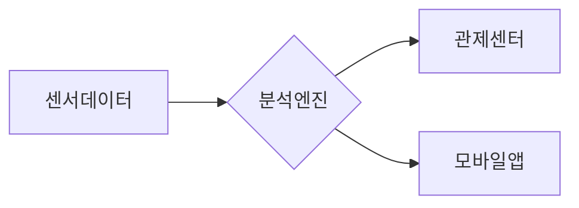

# 1. 사업 개요

## 1.1 배경 및 목적
해양 사고 예방 및 신속한 대응을 위한 스마트 해양 안전 시스템을 구축하고자 합니다.

- **안전 강화**: 실시간 모니터링을 통한 사고 예방
- **효율 상생**: 데이터 기반의 자원 배분 최적화

## 1.2 주요 기능
| 기능분류 | 상세 내용 | 기대 효과 |
| :--- | :--- | :--- |
| 센서 모니터링 | 실시간 환경 데이터 수집 | 이상 징후 조기 발견 |
| AI 분석 | 데이터 분석 및 위험도 예측 | 사고 발생 가능성 최소화 |
| 상황 전파 | 즉각적인 알림 및 대응 지시 | 골든타임 확보 |

# 2. 기술 개발 계획

## 2.1 아키텍처
시스템은 클라우드 기반의 분산 처리 구조로 설계됩니다.

1. **데이터 수집 레이어**: 각종 센서 및 드론 데이터
2. **분석 레이어**: AI 모델을 통한 실시간 위험 분석
3. **표출 레이어**: 대시보드 및 모바일 앱 알림

### 2.2 서비스 아키텍처
아래 다이어그램은 시스템의 주요 데이터 흐름을 보여줍니다.

# 3. 기대 효과
본 사업을 통해 연간 해양 사고율 20% 감소를 목표로 합니다.
